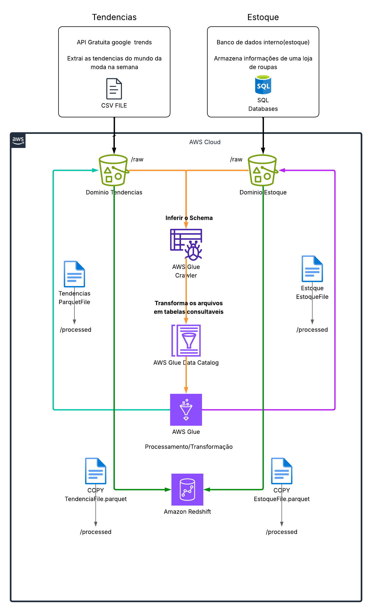

# Plataforma de Inteligência de Estoque e Tendências (Fashion Lakehouse)

## Visão Geral do Projeto

A **Plataforma de Inteligência de Estoque e Tendências** é uma arquitetura de Lakehouse analítico voltada para o setor de varejo de moda. O objetivo central é realizar o **benchmarking competitivo de sortimento e precificação**, integrando dados de mercado externos (catálogo de produtos do e-commerce da Zara) com os dados transacionais de estoque interno da loja.

O pipeline soluciona o desalinhamento entre a oferta dos grandes players de mercado e o inventário em depósito, viabilizando análises de cobertura de catálogo, faixas de preços e penetração de tecidos e modelagens.

---

## Diagrama da Arquitetura

Abaixo está a representação visual dos fluxos de dados, componentes de nuvem e camadas de transformação do projeto:

## Detalhamento dos Componentes e Fluxo de Dados

A arquitetura adota os conceitos de **Data Mesh** (dados divididos e tratados por domínios de negócio) e **Arquitetura Medallion** (organização por camadas de maturidade).

### 1. Fontes de Dados e Domínios

- **Domínio Mercado / Concorrência (Zara Dataset):**
  - Arquivos semiestruturados contendo múltiplos catálogos segmentados por gênero (`Men` e `Women`) e por categorias de vestuário (`BLAZERS`, `JEANS`, `SHIRTS`, `TROUSERS`, entre outras).
  - Contém metadados de produto, descrições têxteis ricas, faixas de preço e referências visuais.
- **Domínio Estoque Interno:**
  - Base relacional simulando o ecossistema transacional de uma rede de vestuário (SKUs, categorias cadastradas, níveis de estoque disponível e custos).

---

### 2. Camada de Ingestão e Armazenamento (Amazon S3 - Camada Raw / Bronze)

- **Separação por Buckets de Domínio:** Cada domínio possui um bucket ou prefixo segregado na AWS, garantindo isolamento e políticas de acesso restritas.
- **Zona Bruta (`/raw`):** Os dados são ingeridos no formato original (CSV), mantendo o histórico inalterado da extração e respeitando a hierarquia de pastas de origem.

---

### 3. Governança e Catalogação (AWS Glue Data Catalog)

- **AWS Glue Crawlers:** Rastreadores automatizados varrem os diretórios brutos no Amazon S3, detectam formatos, inferem esquemas e registram os metadados.
- **Data Catalog:** Consolida o catálogo de metadados centralizado, tornando os arquivos armazenados no S3 consultáveis como tabelas lógicas para as etapas seguintes de computação.

---

### 4. Processamento Distribuído e Enriquecimento (AWS Glue Job - Camada Processed / Silver)

- **Ingestão em Lote e Unificação:** Leitura distribuída dos múltiplos arquivos CSV distribuídos nos diretórios de gênero e categoria.
- **Feature Extraction e Parsing Textual:** Mineração de atributos contidos nas descrições de texto das peças (extração de composição de tecidos como linho, algodão e viscose, além de padrões de modelagem e corte).
- **Padronização e Limpeza:** Normalização de campos monetários, tratamento de valores nulos e tipagem estruturada de datas.
- **Persistência Otimizada (`/processed`):** Gravação dos dados tratados de volta nos respectivos buckets S3 no formato colunar **Parquet**, reduzindo custos de armazenamento e acelerando consultas analíticas.

---

### 5. Data Warehousing Analítico (Amazon Redshift - Camada Consumption / Gold)

- **Carga de Alta Performance (`COPY`):** O Amazon Redshift executa comandos de ingestão massiva paralela diretamente a partir dos arquivos Parquet localizados nas pastas `/processed` do S3.
- **Modelagem Dimensional:** Construção de tabelas analíticas organizadas em esquema estrela (_Star Schema_), permitindo cruzamentos diretos entre produtos do mercado e disponibilidade em estoque.
- **Idempotência e Segurança:** Operação baseada em papéis IAM com permissões de privilégio mínimo e cargas estruturadas para evitar duplicidade de registros.

---

## Roadmap de Implementação

- [x] Definição de arquitetura, ferramentas e desenho conceitual do pipeline.
- [ ] Fase 1: Sanitização local dos dados de catálogo e rotina de upload automatizado para o Amazon S3 (`/raw`).
- [ ] Fase 2: Configuração de Crawlers, catálogo de metadados no AWS Glue e execução do Glue Job para geração de Parquet (`/processed`).
- [ ] Fase 3: Provisionamento do Amazon Redshift, criação do DDL dimensional e execução das rotinas de comando `COPY`.
- [ ] Fase 4: Automação e orquestração do pipeline de ponta a ponta.
- [ ] Fase 5: Integração com camada de visualização analítica (BI).
